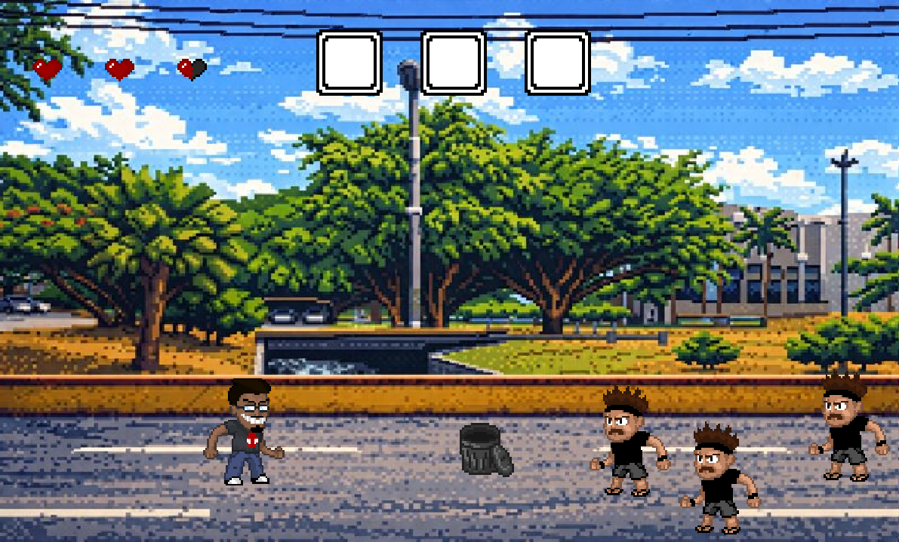
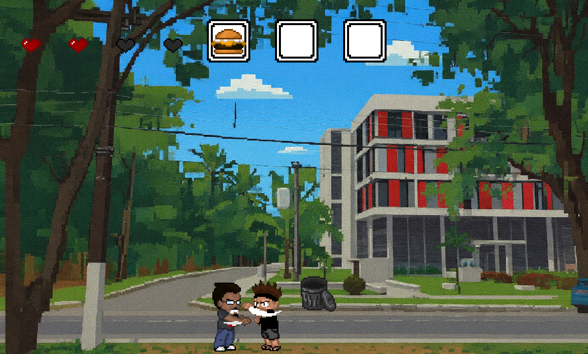
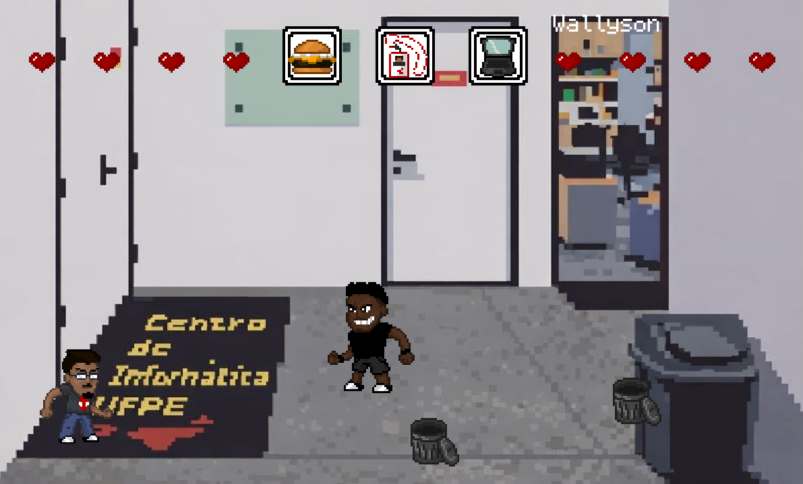
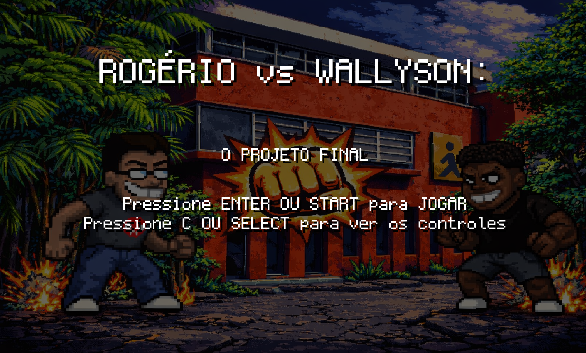
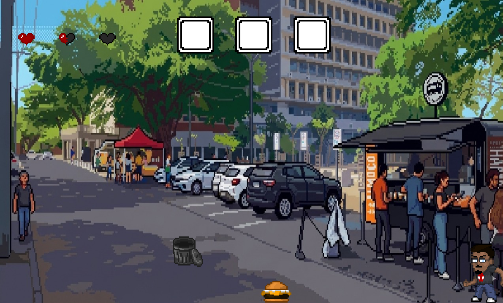
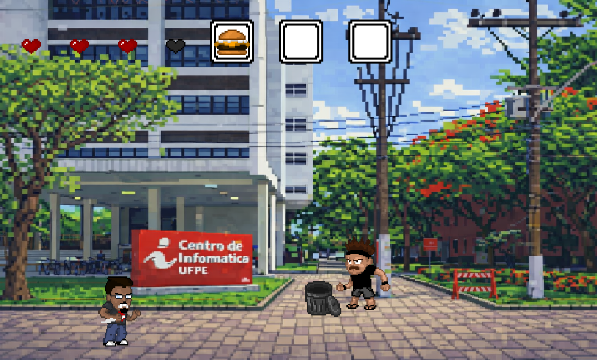
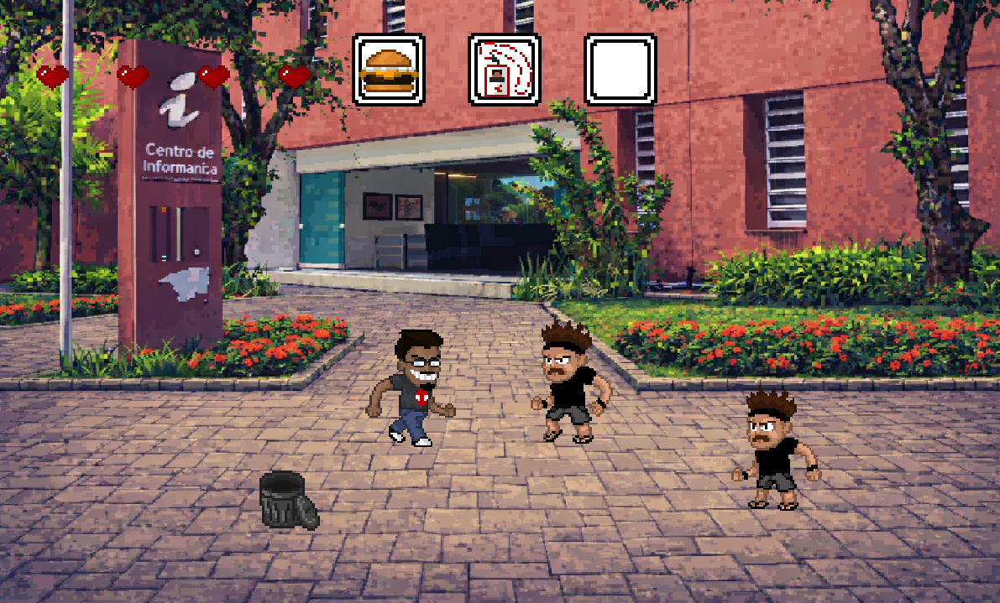

# Rogério vs. Wallyson: O Projeto Final

**Disciplina:** Introdução à Programação (IP) - CIn/UFPE
**Semestre:** 2025.2

## 👥 Membros da Equipe
* **Alex Sandro Lacava Vieira Junior** - ([lacavaalex](https://github.com/lacavaalex))
* **Bruno Antonio da Silva** - ([brunoantsilvs-bas6](https://github.com/brunoantsilvs-bas6))
* **Cleyton Junior da Silva Cardoso** - ([cleytoncardoso](https://github.com/cleytoncardoso))
* **José Romildo Damião dos Santos Junior** - ([joseromildo0](https://github.com/joseromildo0))
* **Rogério Henrique de Miranda Tavares** - ([RogerioHenrique1403](https://github.com/RogerioHenrique1403))
* **Wallyson Rodrigues da Silva** - ([ExeWall ](https://github.com/ExeWall))

---

## 🕹️ Sobre o jogo

Desenvolvido em Python com a biblioteca Pygame, este é um Beat 'em Up 2D clássico focado em combate e estratégia.

---

## 📜  Historia

Rogério, um aluno de Introdução à Programação (IP), tem uma missão clara: chegar ao Centro de Informática (CIn) para apresentar seu projeto. Mas o caminho não está livre. O rival Wallyson está decidido a impedir sua aprovação e enviou um exército de oponentes para bloquear cada passo do trajeto.

---
## 🎯 Objetivo

Assuma o controle de Rogério, enfrente as hordas de inimigos comandadas por Wallyson e colete os itens necessários para desbloquear a entrada do CIn. Aqui, a única regra é derrotar quem estiver na frente para garantir sua nota.

---

## 🏗️ Arquitetura do Projeto

Para amplificar a organização e a manutenção do código, o projeto foi estruturado separando claramente a lógica de programação dos recursos visuais.

A estrutura de diretórios está organizada da seguinte forma:

```text
📁 Projeto
├── res/                           
│   ├── fonts/                    
│   ├── sprites_boss/              
│   ├── sprites_inimigo/           
│   ├── sprites_itens/           
│   ├── sprites_jogador/           
│   ├── sprites_textura/           
│   └── sprites_vida/              
├── src/                           
│   ├── chefe.py                   
│   ├── configuracoes.py           
│   ├── inimigo.py                 
│   ├── interface.py               
│   ├── item.py                   
│   ├── jogador.py                 
│   ├── jogo.py                   
│   ├── main.py                   
│   ├── personagem.py             
│   └── textos.py                  
```
---

## 📸 Galeria do Projeto










## 🛠️ Ferramentas e Bibliotecas Utilizadas

* **GitHub** - Repositório do projeto e controle de versão.
* **Visual Studio Code** - Ambiente de desenvolvimento (codificação).
* **Pygame** - Biblioteca utilizada para gerenciar gráficos, sons e o *loop* do jogo.
* **WhatsApp e Discord** - Canais de comunicação interna da equipe.
* **Piskel** - Criação de *sprites* dos personagens.
* **Gemini** - Auxílio na parte gráfica (cenários).

## 📋 Divisão de Trabalho

* **Alex Sandro Lacava Vieira Junior** - Criação da tela de jogo e arquivos iniciais (`main`, `jogo`, etc); Implementação da classe `Jogador` com movimentação e limites; Definição de layout e *Game States*; Refinamento gráfico e criação da classe `Chefe` e da dinâmica de luta, criação dos sprites de Jogador, auxílio na organização do código seguindo os pilares de POO.
* **Bruno Antonio da Silva** - Criação da classe `Inimigo` e implementação de lógica de dano e morte, contribuição na busca por materiais de estudos para os novos conceitos introduzidos para o projeto.
* **Cleyton Junior da Silva Cardoso** - Implementação da coleta e visualização de itens, além da definição de atribuições específicas para cada item, e elaboração do README.
* **José Romildo Damião dos Santos Junior** - Criação da classe `Item`, com a lixeira e implementação nas fases; Sistema de colisão com personagem e destruição; Atualização de vida, *drops* e visualização da vida.
* **Rogério Henrique de Miranda Tavares** - Ideação do loop de jogo, apresentação do protótipo inicial, Aplicação dos sprites e divisão em pacotes; Aplicação de herança; Aplicação dos cenários.
* **Wallyson Rodrigues da Silva** - Gerador de inimigos (implementação de listas de objetos); Finalização do *Game Loop*: criação das fases e condição de vitória, auxílio na construção do slide.

---

## 📚 Conceitos da Disciplina Utilizados

* **Estruturas Condicionais (If/Else):** Essenciais para o gerenciamento de estados (Menu, Jogo, Game Over) e lógica de combate/colisão.
* **Laços de Repetição (While/For):** Mantêm o *Game Loop* ativo e iteram sobre listas de inimigos e frames de animação.
* **Listas:** Armazenam grupos de *sprites*, itens coletados e sequências de animação.
* **Dicionários:** Organizam as configurações de cada fase (cores, posições de inimigos) via chave-valor.
* **Tuplas:** Definem dados imutáveis como coordenadas `(x, y)` e cores RGB.
* **Funções:** Modularizam o código, separando a lógica de desenho, atualização e movimentação.

---

## 💡 Desafios, Erros e Lições Aprendidas

* **Aprendizados sobre Orientação a Objeto:** Houve um esforço a mais para introduzir a base de POO na maioria dos membros, cujos quais não estavam familiarizados com esse paradigma.
* **Uso da bilbioteca PyGame:** Viu-se necessário um tempo para estudo do que cada módulo da biblioteca fazia e como se comportava junto dos conceitos introduzidos na disciplina.
* **GitHub:** A dinâmica de commits e manuseamento do GitHub Web e GitHub Desktop foi algo essencial para o desenrolar do projeto.
* **Gerenciamento de tempo:** Consolidar todas as atividades do projeto em uma curta janela de tempo foi um desafio durante o processo.


### Qual foi o maior erro cometido durante o projeto? Como vocês lidaram com ele?
**A consolidação dos recursos gráficos do pygame com a estruturação código em POO.**
* **Como lidamos:** Primeiro nos baseamos nos objetos para depois adaptar aos recursos gráficos, em vez de usar os recursos como base para criar os objetos (algo que foi feito no ínicio do protótipo, quando estavamos nos familiarizando com o PyGame).

### Qual foi o maior desafio enfrentado durante o projeto? Como vocês lidaram com ele?
**O aprendizado de Git e GitHub.**
A maior parte dos integrantes não tinham utilizado o GitHub ou não tinha trabalhado de forma colaborativa por ele. Por isso, foi necessário o aprendizado para possibilitar 
* **Como lidamos:** Utilizamos o material disponibilizado no REDU, além de grande colaboração dos integrantes já experientes com o GitHub.

### Quais as lições aprendidas durante o projeto?
* **Comunicação é a chave:** Buscar melhorar a comunicação entre os integrantes foi essencial para garantirmos o sucesso do projeto. Nos reunimos constantemente ao lado da criação tanto para ajuda, como para troca de ideias.
* **Divisão de tarefas:** A separação de responsabilidades e tarefas foi o essencial para que garantíssemos que conseguiríamos entregar no prazo.
* **Trabalho em equipe:** Colaboração constante entre a equipe fez a diferença no resultado. Mostra a importância do trabalho em grupo.
